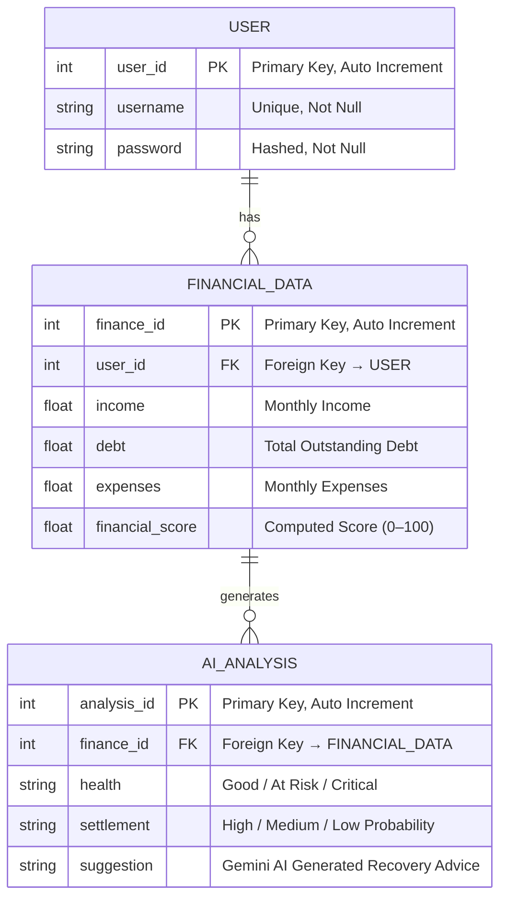

# Entity Relationship Diagram
## AI Powered Debt Relief and Financial Recovery Platform — FinRelief AI

---

## ERD Diagram



---

## Data Flow Overview

```
┌─────────────┐   1       *   ┌──────────────────┐   1       *   ┌──────────────┐
│    USER     │───────────────│  FINANCIAL_DATA   │───────────────│ AI_ANALYSIS  │
│─────────────│               │──────────────────│               │──────────────│
│ user_id  PK │               │ finance_id     PK │               │ analysis_id  │
│ username    │               │ user_id        FK │               │ finance_id   │
│ password    │               │ income            │               │ health       │
└─────────────┘               │ debt              │               │ settlement   │
                              │ expenses          │               │ suggestion   │
                              │ financial_score   │               └──────────────┘
                              └──────────────────┘
```

**Step-by-step platform flow:**
1. USER registers and logs into the FinRelief AI platform
2. USER enters income, debt, and expenses on the dashboard
3. Data is saved as a FINANCIAL_DATA record with a computed financial_score
4. The AI model runs on the financial record → results saved as AI_ANALYSIS
5. USER sees health label, settlement prediction, and Gemini AI advice

---

## Entities and Attributes

### 1. USER
Stores the login credentials and identity of every registered platform user.

| Column   | Type         | Constraint       | Description                         |
|----------|--------------|------------------|-------------------------------------|
| user_id  | INT          | PRIMARY KEY      | Unique ID, auto-incremented         |
| username | VARCHAR(100) | UNIQUE, NOT NULL | Login name chosen by the user       |
| password | VARCHAR(255) | NOT NULL         | Bcrypt-hashed password, never plain |

---

### 2. FINANCIAL_DATA
Stores each financial submission made by a user on the dashboard.
Each record is linked to the user who submitted it via user_id.

| Column          | Type          | Constraint       | Description                              |
|-----------------|---------------|------------------|------------------------------------------|
| finance_id      | INT           | PRIMARY KEY      | Unique ID for each financial submission  |
| user_id         | INT           | FOREIGN KEY      | Links to USER.user_id                    |
| income          | DECIMAL(15,2) | NOT NULL         | Monthly income entered by the user       |
| debt            | DECIMAL(15,2) | NOT NULL         | Total outstanding debt amount            |
| expenses        | DECIMAL(15,2) | NOT NULL         | Monthly living expenses                  |
| financial_score | DECIMAL(5,2)  | Computed (0–100) | Score calculated by prediction.py        |

---

### 3. AI_ANALYSIS
Stores the AI-generated analysis results for each financial submission.
Each record is linked to a specific FINANCIAL_DATA record via finance_id.

| Column      | Type         | Constraint  | Description                                          |
|-------------|--------------|-------------|------------------------------------------------------|
| analysis_id | INT          | PRIMARY KEY | Unique ID for each AI analysis result                |
| finance_id  | INT          | FOREIGN KEY | Links to FINANCIAL_DATA.finance_id                   |
| health      | VARCHAR(50)  | NOT NULL    | Health label: Good / At Risk / Critical              |
| settlement  | VARCHAR(100) | NOT NULL    | Settlement label: High / Medium / Low Probability    |
| suggestion  | TEXT         | NOT NULL    | Gemini AI generated financial recovery advice        |

---

## Relationships Explained

### Relationship 1 — USER to FINANCIAL_DATA

```
USER ||--o{ FINANCIAL_DATA : "has"
```

| Property    | Detail                                                        |
|-------------|---------------------------------------------------------------|
| Type        | One-to-Many                                                   |
| Direction   | One USER can own many FINANCIAL_DATA records                  |
| Foreign Key | user_id stored inside FINANCIAL_DATA references USER          |
| Meaning     | A user can submit multiple financial snapshots over time      |
| Cascade     | Deleting a USER removes all their linked FINANCIAL_DATA rows  |

**Illustrated example:**
```
USER
└── user_id = 1,  username = "john_doe"
      │
      ├── FINANCIAL_DATA  (finance_id = 101,  user_id = 1)  ← January submission
      └── FINANCIAL_DATA  (finance_id = 102,  user_id = 1)  ← March submission
```

---

### Relationship 2 — FINANCIAL_DATA to AI_ANALYSIS

```
FINANCIAL_DATA ||--o{ AI_ANALYSIS : "generates"
```

| Property    | Detail                                                             |
|-------------|--------------------------------------------------------------------|
| Type        | One-to-Many                                                        |
| Direction   | One FINANCIAL_DATA record can produce many AI_ANALYSIS results     |
| Foreign Key | finance_id stored inside AI_ANALYSIS references FINANCIAL_DATA     |
| Meaning     | A financial record can be re-analyzed when the AI model is updated |
| Cascade     | Deleting a FINANCIAL_DATA record removes all its AI results        |

**Illustrated example:**
```
FINANCIAL_DATA
└── finance_id = 101,  income = 5000,  debt = 15000
      │
      ├── AI_ANALYSIS  (analysis_id = 501,  finance_id = 101)  ← First AI run
      └── AI_ANALYSIS  (analysis_id = 502,  finance_id = 101)  ← Re-run after update
```

---

## Relationship Summary Table

| # | Parent Table   | Child Table    | Type        | Foreign Key in Child Table      |
|---|----------------|----------------|-------------|---------------------------------|
| 1 | USER           | FINANCIAL_DATA | One-to-Many | FINANCIAL_DATA.user_id          |
| 2 | FINANCIAL_DATA | AI_ANALYSIS    | One-to-Many | AI_ANALYSIS.finance_id          |

---

*Generated for: FinRelief AI — AI Powered Debt Relief and Financial Recovery Platform*
*Internship Project Documentation — Database Design*
